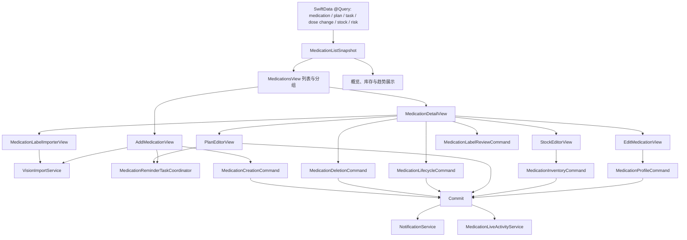

# MedicationsView 依赖图（2026-07-26）

## 范围与基线

- 事实来源：`ios-app/MedicationAdherenceApp/MedicationAdherenceApp/Views/MedicationsView.swift` 当前 6,005 行源码，以及下表列出的既有 service/core 类型。
- 本文只记录已存在的读取、写入、权限和系统副作用，不把尚未实现的拆分写成完成。
- 当前文件的直接 `ModelContext` insert/delete/save/rollback 已为 0。库存、药品资料与照片、计划、新增药品对象图、生命周期、归档级联删除和说明书风险写入均已移出页面；数字为当前源码实测，不沿用旧统计。
- 当前工作树里该文件已有修改；本次依赖梳理没有修改它，也没有移动现有类型。

## 顶层数据流

`Commit --> Notifications/Activity` 表示源码中的顺序约束：相关系统副作用只在对应 SwiftData 保存成功后执行；不是说 `AppPersistenceCommitter` 自身调用这些 service。

## 纵向功能切片

| 切片 | 入口和状态 | 精确读取依赖 | 精确写入与提交 | 提交后的外部副作用 |
|---|---|---|---|---|
| 列表与分组 | `MedicationsView`、`MedicationListSnapshot`、`MedicationListSnapshotCache` | `StoredMedication`、`StoredMedicationPlan`、90 天前至 8 天后的 `StoredDoseTask`、`StoredMedicationDoseChange`、`StoredMedicationStock`、`StoredRiskCard`；`MedicationStockEstimator`、`MedicationLifecycleClassifier` | 无业务写入；只更新页面快照缓存 | 无 |
| 概览与趋势 | `MedicationDashboardSummary`、overview views、`MedicationTrendDetailView`、`MedicationTrendDashboardInput` | 列表快照、`MedicationTrendDashboardBuilder` 所需药品/计划/任务/剂量变化与健康信号快照 | 无 | 无 |
| 详情编排 | `MedicationDetailView` | 6 个 Query 均按当前 medication ID 限定读取 plan/task/risk/stock/label/dose change；`ReadableLabelSummaryBuilder`、`MedicationStockEstimator`、`MedicationLifecycleClassifier` | 照片进入 `MedicationProfileCommand.updatePhoto`，生命周期、删除、说明书保存与风险重建由各自 command 统一 | 只有 committed 后更新展示或处理通知/Live Activity；删除成功后退出详情 |
| 新增与导入 | `AddMedicationView` + `MedicationCreationCommand` | 用户输入、`PhotosPickerItem`/相机、`VisionImportService`、`MedicationImportReview`、`AppPermissionGate` | command 在同一事务创建 `StoredMedication`、`StoredMedicationPlan`、未来 `StoredDoseTask`，按需创建 `StoredMedicationStock`；operation 为 `medication-create-with-plan` | 只有 committed 后按 `MedicationReminderScheduleBatch` 取消旧提醒并调度新提醒 |
| 说明书导入 | `MedicationLabelImporterView` + `MedicationLabelReviewCommand` | 粘贴文本或 `VisionImportService.recognizePrescriptionText` 结果；module 按 medication ID 读取药品、最新 label 和关联风险 | command 在同一事务新建/更新 `StoredMedicationLabel` 并调用不自行保存的 `MedicationRiskReviewService.applyUserLabelRisks`；operation 为 `medication-label-review` | 页面只显示 committed 的风险重建结果；失败保留原说明书和风险状态 |
| 库存编辑 | `StockEditorView` + `MedicationInventoryCommand` | 页面用当前 `StoredMedicationStock?` 初始化表单；module 按 medication ID 查询最新 stock | module 更新现有 stock 或插入新 stock，并显式处理保存失败快照恢复；operation 为 `medication-stock-update` | 只有 committed 才关闭 sheet |
| 计划与剂量 | `PlanEditorView` | 当前 plan、tasks、dose changes、通知/闹钟权限状态 | 新建/更新 `StoredMedicationPlan`，按变化插入 `StoredMedicationDoseChange`，调用 `MedicationReminderTaskCoordinator.reconcilePlan`，再把剂量时间线应用到 open tasks；operation 为 `medication-plan-update` | 保存成功后取消旧提醒并调度 batch |
| 药品资料编辑 | `EditMedicationView` + `MedicationProfileCommand` | 页面用当前 `StoredMedication` 初始化表单并保留隐藏备注；module 按 medication ID 查询 | module 核验/规范化药名，更新名称、通用名、规格、剂型、类型、照片、颜色、药盒编号和合并后的备注，并显式处理保存失败快照恢复；operation 为 `medication-profile-update` | 只有 committed 才关闭 sheet |

## 现有 deep modules 与边界

- 领域计算已经不在 View 内重复实现：库存使用 `MedicationStockEstimator`，生命周期使用 `MedicationLifecycleClassifier`，趋势使用 `MedicationTrendDashboardBuilder`，导入复核使用 `MedicationImportReview` 相关 core 类型。
- App adapter 已存在：图片/条码识别由 `VisionImportService` 负责；计划任务重建由 `MedicationReminderTaskCoordinator` 负责；系统通知由 `NotificationService` 负责；说明书风险计算由 `MedicationRiskReviewService` 负责，并由 `MedicationLabelReviewCommand` 统一提交和返回明确结果。
- 事务底座已存在：`AppPersistenceCommitter` 负责保存失败回滚和统一失败提示。库存、药品资料、计划、新增药品对象图、生命周期、级联删除与说明书风险均已由对应 command 组织 ModelContext 变更；View 只剩药品照片直接保存。
- 通知与相机权限仍保留在各页面的系统 adapter seam；图片识别的请求取消、迟到结果拒绝和输出整形已统一到 `VisionImportPipeline` 与 generation gate。

## 写入依赖顺序

1. 新增药品：校验名称和权限 → 插入 medication/plan/stock → coordinator 生成任务变更 → 单次保存 → 通知调度。
2. 修改计划：校验权限 → 更新 plan/dose change/open tasks → 单次保存 → 通知重排。
3. 停用或归档：更新生命周期和未来任务 → 单次保存 → 取消通知并结束 Live Activity。
4. 恢复启用：coordinator 重建任务 → 单次保存 → 通知重排。
5. 删除已归档药品：删除日志、任务、计划、剂量变化、风险、库存、说明书、生命周期事件和 medication → 单次保存 → 取消通知并结束 Live Activity。

## 后续拆分顺序（尚未实现）

1. 库存 upsert 与药品资料更新 module 已完成，共有 9 项 hosted tests 固定成功、拒绝和保存失败回滚。
2. 计划保存与新增药品对象图事务已完成；通知权限留在页面/adapter 边界，通知调度只消费提交成功结果。
3. 生命周期切换与归档级联删除已完成；删除只消费精确对象图，并在 committed 后处理通知与 Live Activity。
4. 说明书保存/风险重建失败结果及 OCR/条码取消与结果编排均已完成；`VisionImportService` 保持输入 adapter，不并入持久化 implementation。
5. 展示组件和趋势组件保持现状，直到剩余写入 module 有测试后再按导航边界移动；不按行数机械拆文件。

## 下一小步的验证要求

- 库存、药品资料与照片、计划、新增药品对象图、生命周期、归档级联删除、说明书风险及导入编排均已有 hosted tests；继续变更时仍需先补对应防回退测试。
- module interface 返回明确成功/失败，不向 View 暴露新的 ModelContext 操作。
- 保存失败不得关闭 sheet，不得调度通知，也不得留下部分对象变更。
- 完成后运行相关 hosted tests、`git diff --check` 和 `tools/verify-native.sh`。
