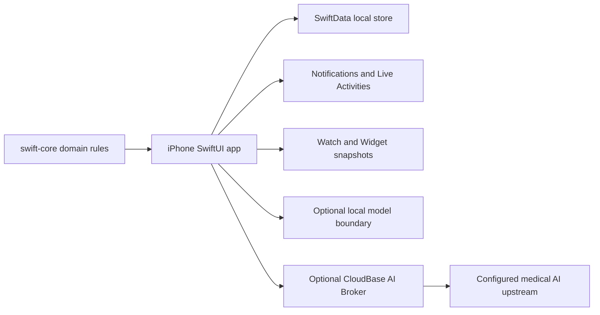

# MedCue architecture

## System boundary

The iPhone app owns persistence and application commands. Watch, Widget,
notifications, and Live Activities are platform surfaces that display a
controlled snapshot or submit a bounded action back through the iPhone command
path.

## Repository modules

| Module | Responsibility | Boundary |
| --- | --- | --- |
| `swift-core/` | Portable medication models, schedules, adherence, trends, inventory, label, risk, and AI-safety rules | Pure Swift package; no SwiftData or UI ownership |
| `ios-app/MedicationAdherenceApp/` | SwiftUI presentation, SwiftData persistence, application commands, system adapters, Watch app, Widget, and Live Activity extension | Apple-platform integration and user-visible state |
| `Packages/LlamaFramework/` | Local model runtime package boundary and public stub used by source verification | Does not define product policy or credentials |
| `cloudfunctions/medcue-ai-broker/` | Narrow CloudBase HTTP adapter for the optional cloud-AI path | Validates the request contract and upstream allowlist; does not become a general proxy |
| `tools/` | Reproducible tests, preflight checks, native verification, and sensitive-artifact checks | Verification and release-safety tooling only |

## State ownership

1. SwiftData is the durable local source for medication plans, dose records,
   lifecycle events, and related user-managed data.
2. Application commands own validation, idempotency, and transaction ordering.
3. A successful SwiftData commit precedes success UI and post-commit effects.
4. Watch and system surfaces receive controlled snapshots or bounded action
   requests; they do not replace the iPhone store.
5. AI context is assembled from explicit user-authorized scopes. AI output is
   passed through a safety boundary before display or persistence.

## Trust boundaries

- **Local user data:** medication, dose, health, photo, and visit-summary data
  remain local unless the user authorizes a specific cloud context scope.
- **Platform services:** HealthKit, notifications, WatchConnectivity, and Live
  Activities are optional adapters and can be unavailable or denied.
- **Cloud AI:** the Broker is an opt-in adapter with a constrained request
  contract, HTTPS transport, endpoint policy, and response validation.
- **Local model assets:** the real model binary and GGUF file are local ignored
  assets; the public repository contains only the package boundary/stub.

## Change rules

- Put domain behavior in `swift-core/` when it can be expressed without Apple
  frameworks.
- Put persistence and transaction ordering in application commands and model
  services, not in view rendering.
- Extend existing adapters and seams before introducing a new abstraction.
- Treat migration, dose records, medical AI, privacy, and system-surface actions
  as higher-risk changes requiring failure-path and ordering tests.
- Update this document only when ownership, boundaries, or trust assumptions
  change; link to evidence rather than copying historical status into it.
