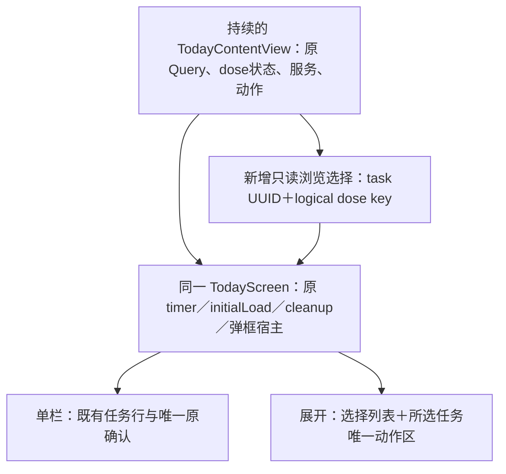

# #163 下一切片：首页任务核对与隔离五药 demo

> Historical implementation/design record, 2026-10-10. Stage labels identify evidence boundaries, not ancestors of this public-preparation branch. Original source/evidence mappings are retained separately. Current acceptance and publication status are in [plan.md](plan.md); no historical result proves this public revision passed.

2026-10-10 UTC。**仅设计与落点评估，未实现，未验证原生布局。**

冻结待审 P2 HEAD `implementation-stage-02`，tree `implementation-stage-02-tree`。
设计评估自身仅新增此说明，不修改生产文件。随后协调审查回执完整审查已结束，并另行授权只修测试导航与更新原 retained evidence 版本；本说明随该测试修复提交交付，不新增重复交付包、不推送、不操作 Mac。
既有 [plan.md](plan.md)、[validation.md](validation.md)、[ownership.json](ownership.json) 继续作为各阶段原证据；本文不覆盖其历史状态。

## 目标与真实代码约束

完整模式首页的主问题是“先找这次任务，再核对这次药品与剂量”。展开态用增加的空间同时完成这两件事；普通 iPhone 保持当前就地操作的便利。适老首页继续沿用 P2 当前任务模式，不在此切片改其交互或再次搬模式入口。

已读取冻结源码：

- `Views/TodayView.swift`：持续存在的 `TodayContentView` 持有任务/药品/计划 Query、`pendingDoseConfirmation`、`TodayDoseInteractionState`、保存/回滚/提醒服务与真实动作。新浏览状态应由这里持有，不能移走这些 owner。
- `Views/TodayScreen.swift`：现在1358行。唯一外层挂载 initialLoad、timer、scene、归档弹框、帮助sheet、失败提示及 cleanup。其 timeline 同时放待处理、已处理、归档、下一次提醒与条件性的完成展示。
- `Views/TodayDoseTimelineViews.swift`：`TimelineDoseTaskRow` 将时间、药品 NavigationLink、三种动作、`InlineDoseConfirmationCard` 放在同一行。展开态不能把整行复制到右侧，否则会同时存在两套动作/确认入口。
- `Views/TodayDoseProjection.swift`：已有 `visibleOpenTimelineTasks`、`handledTodayTasks`、`archivedTodayTasks`、`nextReminderTask`、真实完成率和空态文案。visibleOpen 还含迁移动画中的记录，不能以“数组非空”直接推断仍可服用。
- 完整 TodayScreen 目前没有读取 Query.fetchError/isLoading；适老页已传这两类事实。新增布局必须补呈现参数，不能把失败或尚未加载画成“没有任务”。
- `MedicationPhotoView` 已有图片缓存、缩略图与符号占位；模型已有 form、strength、boxNumber、photoData。复用这些资产，缺图保持符号，不制造真实药盒照片或推导药物剂量。

## 展开态：选择列表与任务核对面板

保留根 TabView/NavigationStack 和原生工具栏、安全区。**不增加嵌套导航根、不以设备名称或姿态 API 判断展开**；只根据实际容器宽度与辅助字号决定内页布局。

| 区域 | 内容 | 操作分工 |
| --- | --- | --- |
| 页面顶端 | 今日标题沿用系统栏；真实通知不可用提示只出现一次，完成/保存反馈沿用现有宿主 | 不增加常驻完成率、连续天数或库存统计墙 |
| 左栏“今日任务” | 待处理时间轴：真实时间、完整药名、剂量、文字状态、小图/符号；保持既有排序。已处理按原 disclosure 收起；归档保留独立层级 | 行点击只选中任务；不直接记录服用，也不含第二套三动作。选中样式有标记与AX selected trait，不只靠颜色 |
| 右栏“这次用药” | 药名→本次剂量与时间→真实状态→剂型/规格、药盒编号及可选小图；现有计划文字只作核对，不替代本次task的doseValue/doseUnit/dueAt | 唯一当前任务动作区；未处理复用taken/delay/skip与真实确认；已处理/归档复用对应reopen/archive/unarchive回调，不绕过事务 |
| 右栏次要入口 | 明确“查看药品资料”的现有 MedicationDetailView 路径 | 左侧行不再同时承担导航；选择任务与进入药品详情是两个有名称的控件 |
| 页面反馈 | 原失败提示、归档确认、撤销banner及保存后反馈 | 仍只有原owner，宽窄切换不重新提交、不重播动作 |

不默认优先未来提醒而越过前面的未确认任务。初次默认选现有可操作待处理序列的第一项；这只是只读核对，不表示推荐服用，不更改due/status。用户可选择未来项，但提前动作仍由既有确认规则判断。

左栏按最小可读预算约280点起、右栏约340点起，加16点间隔与两侧内边距；约668点是首轮测量起点，**不是已证实的 Duo 阈值**。最终以实际容器测量、长药名和原生AX证据校准。两栏保持合理最大宽度与留白，不把40点图标和所有文字按比例放大。

后续首页实施授权明确指出：共享纵向ScrollView会让左侧低位选择时右侧身份仍在屏幕外。因此本候选改为同一Screen内、受页面可用高度约束的两个并列ScrollView，左侧位置独立保留；每次显式选择（包括再次选同一行）只将右侧滚到身份/本次剂量顶部，右侧唯一动作区用safeAreaInset保留实际高度。选择事件才请求VoiceOver身份焦点，timer不重新宣读；出现内联确认时由原确认标题接焦点。AX/窄高不足回单栏，ScrollViewReader定位原选中/确认任务，持续Today owner与P2模式契约不变。默认668×360是未原生校准的内容预算；长名称、确认卡与系统栏实测无法同时容纳核对/动作时应校准预算，不能以缩字、裁剪或消除失败断言通过。详见layout-slice-review.md。

## 普通 iPhone：保留就地操作，重排视觉层级

从上到下为：系统“今日”标题/帮助→必要通知故障提示→今日待处理时间轴→已处理折叠摘要→归档层级→确有用途的下一次提醒。主次顺序清楚，不在主操作之前插入模式推广或统计卡片。

- 待处理行的时间、药名与本次剂量先于动作；药名允许自然换行，不为长名称缩成不可读单行。颜色标记与图标只辅助识别，状态用文字。
- 普通模式保留每行就地动作与原内联确认，不要求先进入另一页才记录。只显示正在确认的那次任务的原确认卡。
- 沿用 `MedicationPhotoView`、`MedicationColorMarker`、`StatusBadge`、`CompactDoseActionButton`、`InlineDoseConfirmationCard`、原玻璃/系统组背景。调整间距与层级，不新造字体、插图或图表资源。
- 撤销banner保留完整可点击范围与底部安全区；现有180点底部占位不能盲删，按普通/Duo系统栏和最大字体验证后才缩减。
- “下一次提醒”不删业务含义：单栏保留原真实提醒摘要；展开态若与正在核对的任务完全相同，则不重复卡片。若核对的是另一项，用紧凑文字/明确“查看”选择入口保留实际下一次提醒；忽略记录摘要仍有可见位置。

## 浏览选择与同一交互状态所有者

只在 TodayContentView 增加一个小的浏览选择 `@State` 与binding。纯选择策略/展示组件放新文件，不在1358行TodayScreen继续堆大型view。所有布局从同一snapshot读，调用同一组actions。

| 触发 | 选择契约 |
| --- | --- |
| 首个成功加载快照，尚无用户选择 | 默认首个仍pending/delayed的可展示task；无可操作task则进入真实空/完成态，不自动选一条历史记录当“待服用” |
| 用户点一行 | 保存UUID与logical key；选择事件零SwiftData提交、零系统副作用 |
| timer、权限返回、Query刷新、字体或容器宽度变化 | 用户选择仍存在则原样保留；不能每次按nextReminder重新选药 |
| 选中项变为taken/delayed/skipped等 | 保留原身份；呈现由当前真实status决定。成功不自动跳到下一药、不把旧confirm回调绑定新药 |
| 正在dose确认/保存/回滚/迁移 | 活动确认与操作task优先；暂停会移走唯一动作区的选择请求，保持原task，提示先完成当前操作。请求前与操作回调使用现有ID验证，不复制pending |
| 同logical key但原UUID失效 | 不默默把旧确认转给另一个UUID。显示原项不可用，待交互结束后让用户明确重新选择；逻辑去重仍由原投影负责 |
| 药品被移除/归档或记录跨日离开有界快照 | 保留选择引用并显示“这条任务已不在当前列表”，禁用旧动作，给明确返回列表/重新选择入口；不冻结ManagedModel副本继续操作 |
| app进程重启 | 浏览选择不持久化；重建只读默认。模式偏好和医疗记录仍遵守原持久化，不新增数据库字段 |

开合只改变同一Screen内排版，不 `if wide { TodayView() } else { TodayView() }`，不 `.id(width/layout)`，不复制Query、timer或service，不调用cleanup以达到重排。内联确认的可视位置可随排版变化，但model中的pending UUID/key与输入、busy不变；AX焦点必须落回同一任务的确认/操作，不落到另一药。

行组件重排可能发生自己的onAppear/onDisappear，但**业务生命周期只能挂在持续外层Screen**。如果布局实现需要重建该owner或挪动剂量状态、修改#138 cleanup，就停止该实现，不把它伪装成纯布局。

## 加载、失败、空态与完成态

优先级：真实查询失败→尚未完成初始加载且无可展示结果→活动确认/动作过渡→正常任务/完成快照。失败时不继续展示可点击的过期任务动作。

| 事实 | 显示与连续性 |
| --- | --- |
| 首次真实加载未完成 | 一处加载提示，占有意义的页面范围；不出现“今天没有任务”或空双栏，不恢复白色首启遮罩 |
| 任一必要Query.fetchError | 一处明确加载失败，保留所选ID供恢复核对；不冒称全部完成。重试必须能说明并验证实际恢复什么 |
| 今天确无任务 | 一处全宽空态，现有药品管理入口可达；无虚构提醒、空detail列或占位统计 |
| 待处理清空，但有忽略/非完成记录 | 原投影的真实文案＋已处理/归档层级；不称全部已服用 |
| 真实全部完成 | 保留现有完成展示与已处理入口，转为内容充足的全宽完成态；不放空选择栏。用户主动核对的刚完成项可作为只读结果上下文保留，reopen/archive由原已处理区唯一提供，避免重复动作 |
| 完成或回滚动画仍在进行 | 原过渡与undo owner继续；不能依据短暂open数组变化抢先清选择、吞确认、跳空态或重播庆祝 |

若还有其他待处理，用户选择的已处理项仍可在右栏核对；此时其reopen/archive动作只在右栏，左侧对应已处理行只做选择。进入全宽完成态后，selected上下文只读、已处理列表承担原动作，仍只一份可操作控件。

**恢复依赖不能被淡化**：当前 `initialTodayLoad()` 刷新时钟、维护与通知权限，并未明确执行失败的SwiftData Query重取。只给它贴“重试加载”不能证明fetchError恢复。后续先用原生故障证据确认现有恢复入口；若必须改持久化/Query生命周期才能真正恢复，拆出独立安全切片交协调者，不能扩大本布局片或编造重试成功。

## 最大辅助字号与无障碍

任何 `.dynamicTypeSize.isAccessibilitySize` 首版均单栏，即使内屏很宽。保留信息与功能，以自然换行、垂直动作和可滚动布局承接；不固定卡片高度、不缩字、不靠horizontalSizeClass强行双栏。

展开→AX/窄窗时，选中ID、pending、inFlight、undo保留；当前确认仍在原任务处。单栏→展开时若有确认，应核对同一确认task，而不是首个默认项。VoiceOver先任务列表，再当前核对内容；选择后给药名、时间、状态的简短反馈，不每次timer更新重读全页。文字/色彩/选中trait共同标状态，照片占位不朗读成真实包装。

原生验收覆盖最大AX、粗体、减少动态、暗色、长药名/单位、RTL与系统栏。语义标签沿用真实完成动词（滴眼等），不一律写“已服用”；点击框、底部Dock/toolbar不遮动作。VoiceOver焦点、触控大小和真正开合必须有原生证据，不能用源审或单张截图代替。

## 首页实现切片的最小文件范围

以下是**审查完成后才可授权落地**的候选范围，不修改P2待审文件；不会把五药demo混进布局diff。

| 文件 | 最小改动 | 不包含 |
| --- | --- | --- |
| `Views/TodayView.swift` | 一个浏览selection @State/binding；完整模式真实loading/fetchError呈现参数；必要的只读计划核对文字 | 不改initialTodayLoad之后任何剂量/cleanup/提醒函数，不改模式P2 guard |
| `Views/TodayScreen.swift` | 持续外层宿主保留；timeline内部挂自适应任务区与空/完成态；按任务唯一分配动作 | 不新增第二套timer或NavigationStack；不改适老UI、模式确认或事务 |
| 新 `Views/TodayTaskWorkspaceView.swift` | 纯选择策略、左侧selector、右侧身份核对及布局预算；只读input/bindings/现有actions | 不持有ModelContext/Query/service；不自建保存和医疗逻辑 |
| `Views/TodayDoseTimelineViews.swift` | 将已有三动作+内联确认抽为同一个小呈现组件，供单栏行/右栏复用；原回调、禁用、语义ID保持 | 不复制动作实现或改#113业务含义；不把档案导航当选择点击 |
| `project.pbxproj` | 新App文件精确FileReference/BuildFile/组/target登记；必要时一个合理独立split文件 | 不搬其他PR项目配置；#73/#160 owner精确审查。测试目录已有同步target无需登记 |
| 新 Tests/TodayTaskSelectionTests、UITests/TodayTaskWorkspaceUITests | 选择、过时ID、状态连续、尺寸/AX、错误/完成/真动作断言 | 不删旧UI断言、不扩timeout/跳过掩盖失败，不改CI |

原有归档/已处理私有代码若无法在合理文件预算内接线，允许将纯呈现拆到第二个小App文件并精确登记，而不是为避免PBX改动把TodayScreen继续堆超1400行。需要变更范围时先说明用途，由协调者串行交接；不能顺手扩大到TodayDoseInteractionState或投影业务。

## 隔离五药 demo：另一个串行切片

历史源已核实为 `Models/DemoDataSeeder.swift`：稳定五UUID、布洛芬/对乙酰氨基酚/人工泪液/氯雷他定/维生素D3、库存、教育说明书/风险、60天历史和VitD剂量变更。没有可复用的旧持久库，五药没有旧包装照片。现有两药合成fixture不可冒充这套历史demo。

推荐最小入口是**现有 DEBUG/MEDCUE_DEMO＋Simulator 隔离fixture新增明确bundled-demo场景与session UUID**。先做可重启的调试入口；Release与普通设备不自动启用，不把Demo scheme相同bundle ID误当隔离。若决赛还需设备上的专用演示入口，另行明确容器与全部外部作用隔离后落地，不先把真实主库导入。

1. `AppRootView.swift / ElderUITestFixture`：增加场景分支，只打开已有测试拥有目录下本session专用store与UserDefaults suite；保存来源/场景版本和“合成演示数据”可见标识。已有场景、两药seed与inspection语义保留，不点击历史rebuild入口。
2. `DemoDataSeeder.swift`：新增受 DEBUG/MEDCUE_DEMO 限制的显式throws种子入口，复用五药definitions与实际seed方法。由隔离factory调用，只首次对新建空owned容器seed；有完成标记的同session重启只加载，不迁移/重种/覆盖记录。API拒绝非空、冲突UUID或不属于本场景的store，不能只靠药名判断安全。
3. 当前seed是private，`seedIfNeeded`吞错，`rebuildForExplicitDemoMode`先delete/save再seed/save，`DemoModeLauncher.rebuildAndExit`还改standard首启键并exit；**三者都不作新场景导入入口**。新入口不得删除、不exit、不写standard偏好，不给主库传空库判断后继续seed的机会。
4. 同一个referenceDate/calendar用于seed历史、今天计划、VitD变更、过时seed迁移与fixture now。源码多处Date()/isDateInToday，不能只改顶层日期然后仍用固定2026-09-05 UI clock；逐一传入基准，默认旧调用保持其原时间行为。
5. seed内部部分fetch使用try?；显式throws入口本身不保证全部读取都成功。新空容器先验证空集合，再seed后验证五UUID/source/demo标记、各药计划/库存/说明书及历史关联/VitD变化；仅真实save及校验成功后写ready标记并呈现。不能将缺资料当成功。失败保留本session错误证据，不对未知库cleanup；失败session隔离/重新建新session需显式操作，不能自动rebuild。
6. `MedicationAdherenceApp.swift`：仅如必要增加明确isolated-demo routing/error分支。当前通用catch的Recovery按钮能重开主库；demo参数无效、seed或打开失败必须保持隔离错误页，不能经这个恢复按钮落回primary store。标准首次初始化/迁移/恢复仍原样。主库被读取或demo错误后允许打开它，均停止切片。
7. 沿用fixture的默认AppStorage、dosePersistence/systemSurface/help替身和Watch/LiveActivity屏蔽。逐条核通知、意图执行器、普通Tab/Profile/Health/AI/导出/启动smoke路径；不能因“fixture active”就假称全部外部副作用已隔离。若某路径不能控制，限制demo可用入口并说明，不能悄然发权限请求/通知/网络或真实拨号。
8. `BundledDemoIsolationTests`与必要fixture UI：主库/standard偏好前后哨兵完全一致、五药身份和关键关联、同session重启不重写、invalid/冲突/保存失败不成功、不fallback、不exit、跨午夜与固定日期一致、Release入口不存在。先以临时独立容器实证，后native代表展示。

demo最小候选为Root fixture、Seeder、新隔离测试；App.swift只有明确隔离routing/error确有需要才动并单独审。旧HelpCenter/first-launch demo按钮目前仍指向历史重建路径；新演示启动不能沿用它们。若要替换这两处用户入口，再串行给出精确owner范围与确认流程；不能只新增fixture就声称旧入口也安全了。

## 验收与停止条件

| 场景 | 可观察断言 | 证据要求 |
| --- | --- | --- |
| iPhone单栏→Duo展开→窄窗/AX→展开 | 同task UUID/key、pending kind、inFlight及undo owner，Query/服务/initialLoad不重复、cleanup不因尺寸触发 | 纯选择行为＋原生状态/动作计数＋受支持开合操作 |
| 两药/长名/滴眼/延迟/未来/逾期 | 左选B右全为B，本次剂量/time来自task；未来仍原确认；timer不抢选 | 实际fixture及AX身份断言，动作后的store日志/计数 |
| 确认/保存中尝试选另一药 | 原pending保留、无第二个确认、无额外commit或副作用 | 现有失败/异步fixture交错，不能只检查控件存在 |
| 当前项处理/归档/跨日/消失/同key另一UUID | 不把旧callback转给新药、不显示可点过期动作；保留清晰只读结果/失效状态 | 纯策略＋真实UI，不修改投影算法来让断言通过 |
| 加载/查询失败/无计划/忽略清空/全完成 | 一处真实含义状态，无空双栏，无假“已服用”；undo/已处理/归档仍可达 | 真实故障注入与独立源审；恢复能力独立证明 |
| 普通/Duo、AX5、暗色、减少动态 | 核对区有独立用途，文字可读、动作唯一可达，系统栏不遮挡，无重复next提醒 | 同源实际截图及AX检查，人工VO；不称硬件性能pass |
| 五药隔离 | standard/主库哨兵不变、identity正确、失败不fallback、重启不seed、无真实外部动作 | 独立store hosted＋native fixture/Release构建 |

先修独审Required并集中验证P2，随后demo和布局逐片落地，各自自审与精确HEAD证据，不混成大diff。新布局测试需复用证据支持的导航定位；完整模式不等于一定存在TabBar。

停止相关实施：需要重建Today owner、改剂量生命周期/事务/#138状态、碰schema/迁移/主库；选中/确认跨task错配或重复操作；新文件越预算且拒绝合理拆分；取不到真实加载/恢复证据却想冒称空态/重试成功；demo来源/容器不明或任何delete/rebuild/standard写入；外部副作用控制不全；系统姿态/API/个人toolbar身份未经SDK/原生证据核实。保留失败证据，拆开依赖，继续独立可做部分，不扩门禁、不收费、不安装依赖。

## P2 独审问题与随后授权的测试修复

`ExperienceModeUITests.assertComplete` 硬要求TabBar，`openCompleteSettings`按第5项选择，且iPhone guard包含Duo。协调审查回执已确认PR162 Duo原生导航在Toolbar、TabBar不存在；该位置假设是测试缺陷，不能称产品失败或无条件skip。

冻结源码 `MedicationBrowseNavigationUITests.openMedicationTab` 已采用真实bottom label“药品”或Toolbar `identifier=pills,label=药品` 路径，并严格count/hittable/selected＋`tab.medications`＋真实药品页面断言。授权修复复用其**严格唯一身份与实际内容确认的策略**：只查原生TabBar/Toolbar中的精确AppTab标签“今日/个人”，两容器各至多1项、可点项合计必须等于1；再核selected与实际`tab.today`/timeline、`tab.profile`/`profile.root`/唯一`profile.settings`及真实设置页面。没有按位置索引、设备名分支、宽泛全屏按钮或未知Profile glyph猜测；超出这两种已支持容器就失败，不跳过或静默放宽。源中有精确中文标签，实际个人Toolbar暴露形式仍待Mac聚焦运行确认，尚未声称这个修复native通过。

本文没有新增外部依赖、图片/字体/模型或新许可来源；使用既有SwiftUI/SwiftData及项目组件。尺寸预算与视觉安排是工程设计候选，未称为Apple指定用药布局、实际设备测量或原生验收通过。
